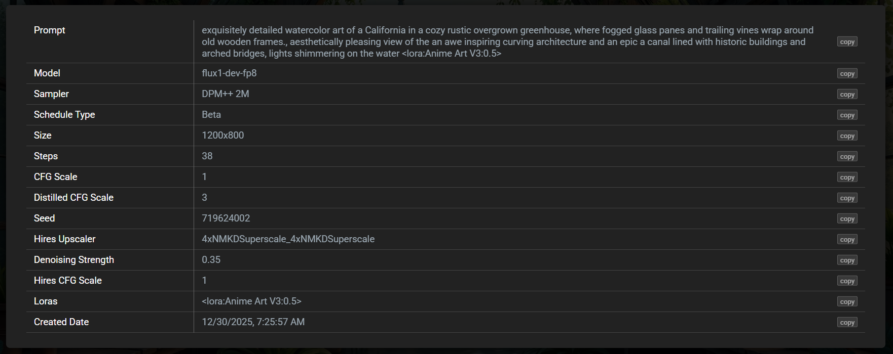
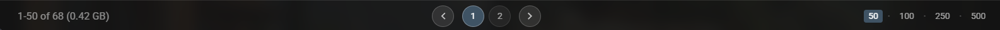

# Diffusion Darkroom

## Image Gallery & AI Image Generation Metadata Viewer

A fast, feature-rich stand-alone web-based image gallery for AI generated images with full metadata support. Automatically scans folders and sub-folders for images. Just drop the app in the root of your output folder. Requires Python 3.x in your system PATH.

## Gallery Features
- Masonry layout with intelligent loading and paging
- Full-screen viewing with auto-hiding controls
- View metadata: model, prompt, sampler, scheduler, LoRAs, size, date, etc.
- Organize with Favorites and Ratings (1-5 stars)
- Filter by Model, Favorites, and Ratings
- Sort by filename or date; search by filename or prompt

## Screenshots

  <table>
    <tr>
      <td align="center">
        
      </td>
      <td align="center">
        
      </td>
    </tr>
    <tr>
      <td align="center">
        
      </td>
      <td align="center">
        
      </td>
    </tr>
    <tr>
      <td align="center">
        
      </td>
      <td align="center">
        
      </td>
    </tr>
    <tr>
      <td align="center" colspan="2">
         
        
      </td>
    </tr>
  </table>

 

## Guide & Controls

### Top Nav Bar
- **Model Filter:** Show/hide images by model (XL, Flux, ZIT, Qwen, etc.)
- **Thumbnail size:** Adjust via slider
- **Search:** By filename and prompt
- **Sort:** By filename or date (click to reverse direction)
- **Favorites & Ratings:** Filter by favorites and/or star rating
- **Refresh:** Reload images and changes

### Bottom Nav Bar
- **Images per page:** Select page size
- **Paging:** Navigate with arrows or page numbers
- **Loading indicator:** Shows progress for layout calculations and image/metadata loading
- **Image count:** Displays filtered image count and total size (GB)

### Thumbnail Features
- **Hover:** Shows filename, model, sampler/scheduler, dimensions, and action buttons (Copy Prompt, Download, Open)
- **Left-click:** Opens lightbox (click again or ESC to close)
- **Right-click:** View metadata table (click again to close)
- **Scroll:** Mouse wheel or click-hold-drag
- **Favorites:** Click heart to toggle (moves to/from Favorites folder)
- **Ratings:** Click star to rate 1-5 (appends rating to filename)
- **Delete:** Click trash to permanently delete 

### Lightbox Controls
- **Zoom:** Click-and-hold to zoom, move mouse to pan (zoom level configurable in settings)
- **Scroll Zoom:** Mouse wheel zooms relative to cursor position
- **Navigation:** Arrow buttons or keyboard arrow keys
- **Close:** ESC key or click outside image
- **Favorites & Ratings:** Same as thumbnail controls

### Metadata Table (Right-click)
- View full parameters: Prompt, Model, Sampler, Schedule Type, Size, Steps, CFG Scale, LoRAs, etc.
- Click any value to copy

### User Settings
- Model buttons, image sizes, zoom levels, paging options, etc. can be edited in the config area of the HTML file 

## Installation

1. Clone the repository and place these files in your image gen output folder:
   - `darkroom.html`
   - `process_images.py`
   - `launch-darkroom.bat` (Windows)
   - `darkroom.png`

2. Run `launch-darkroom.bat` (Windows) or `python process_images.py` (all platforms).

The script scans folders/sub-folders for images, injects the list into the HTML, starts a local web server, and opens the gallery in your browser.

**Note:** Multiple instances can run simultaneously—each uses its own port (8000, 8001, etc.). The HTML file is mostly standalone after initial processing, but a web server is required for metadata extraction due to browser security restrictions.

## Behind the Scenes

### HTML Architecture
- Single-file application for easy deployment
- Embedded image list injected at startup for instant loading
- Self-updating on browser refresh to reflect file system changes
- State preservation: filters, sort, pagination, and size preferences persist across refreshes

### JavaScript Features
- Intelligent masonry layout with dynamic column calculation and layout caching
- Lazy loading with background pre-fetching for instant viewing
- Background metadata indexing for fast filtering
- Scroll position preservation during layout changes and refreshes
- Optimized rendering with `requestAnimationFrame` and batched operations
- Memory-efficient caching of metadata and image data

### Python Backend
- Recursive image scanning across directory trees
- PNG metadata extraction (prompt, model, sampler, etc.)
- Dynamic HTML injection for standalone operation
- Multi-port server (auto-finds available ports 8000+)
- File operations API: move (favorites/ratings), delete, update embedded list
- Graceful error handling for client disconnects

## Supported Formats

PNG, JPG/JPEG, GIF, WebP
